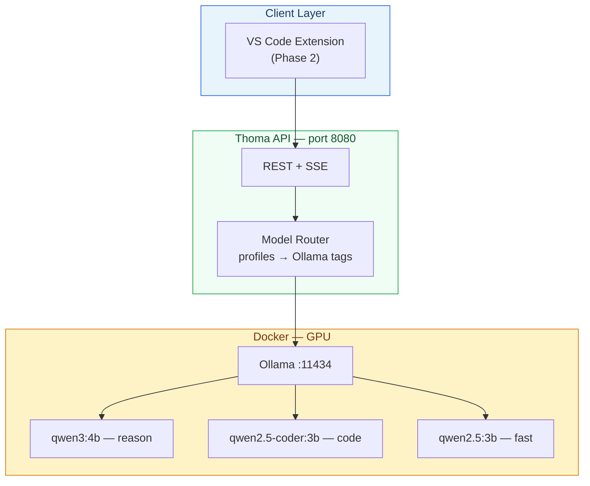

# Thoma — Project Plan

Self-hosted, open-source coding assistant (Cursor-like) with switchable thinking models, Docker deployment, and VS Code extension integration.

**Hardware:** NVIDIA RTX 4050 (6 GB VRAM) and Apple Silicon (MPS/Metal)

---

## TL;DR

| Item | Choice |
|------|--------|
| Name | **Thoma** (after Thomas — verifies before acting) |
| UI path | VS Code extension first (Phase 2) |
| Backend | Docker: Ollama + Thoma API |
| Models | 3B–4B primary; 7B only with Q3 + 2K–4K context |
| Rule | **One model loaded at a time** on 6 GB VRAM |

---

## 1. Vision

Thoma is a privacy-first coding assistant that:

1. Chats with full repo context
2. Runs agent loops (read / write / terminal with approval)
3. Shows **thinking traces** from reasoning models
4. **Hot-swaps models** per task (reason → code → fast)
5. Runs entirely via Docker on your machine

---

## 2. Architecture



**Pattern:** Continue.dev-style — shared `core` logic + thin VS Code adapter. Docker hosts inference; the editor is the UI.

---

## 3. Model Strategy — RTX 4050 6 GB VRAM

### 3.1 VRAM budget

| Component | Typical use on 6 GB |
|-----------|---------------------|
| OS + display | ~0.5–1.0 GB |
| Model weights (Q4 7B) | ~4.5 GB |
| KV cache (4K ctx) | ~0.5–1.0 GB |
| **Headroom** | Often **zero** at 7B Q4 |

**Operational rules:**

1. Load **one model at a time** (`OLLAMA_MAX_LOADED_MODELS=1`)
2. Cap context at **2048–4096** tokens for 6 GB (`OLLAMA_CONTEXT_LENGTH=4096`)
3. Prefer **3B–4B** models at Q4/Q5 over **7B at Q3**
4. Enable flash attention + quantized KV cache (see `docker/.env.example`)
5. Unload before switch: `POST /api/models/unload` or Ollama `keep_alive: 0`

### 3.2 Recommended Thoma profiles (6 GB — primary)

| Profile | Ollama model | Quant | VRAM (weights) | Context | Role |
|---------|--------------|-------|----------------|---------|------|
| **thoma-reason** | `qwen3:4b` | Q4 | ~2.5 GB | 4K | Thinking / planning / agent |
| **thoma-code** | `qwen2.5-coder:3b` | Q4 | ~2.0 GB | 4K | Implementation / refactor |
| **thoma-fast** | `qwen2.5:3b` | Q4 | ~2.0 GB | 4K | Quick Q&A, summaries |
| **thoma-reason-lite** | `deepseek-r1:1.5b` | Q4 | ~1.2 GB | 4K | Visible CoT when Qwen3 unavailable |

### 3.3 Stretch profiles (6 GB — use with care)

| Profile | Ollama model | Quant | VRAM | Context | Trade-off |
|---------|--------------|-------|------|---------|-----------|
| **thoma-code-7b** | `qwen2.5-coder:7b` | Q3_K_M | ~3.9 GB | **2K max** | Better code quality; may OOM |
| **thoma-reason-7b** | `deepseek-r1:7b` | Q3_K_M | ~4.0 GB | **2K max** | Stronger reasoning; slow + tight |
| **thoma-general-7b** | `qwen2.5:7b` | Q3_K_S | ~3.8 GB | **2K max** | General chat; quality vs 4B modest |

### 3.4 Not feasible on 6 GB (defer until GPU upgrade)

| Model | Why |
|-------|-----|
| `deepseek-r1:32b`, `qwen2.5-coder:32b` | Need 24 GB+ VRAM |
| `qwen3:30b-a3b` MoE | Needs 12 GB+ even with partial load |
| `qwen3:8b` + thinking at Q4 | Often OOM with KV cache |
| Two models loaded simultaneously | Exceeds 6 GB |

### 3.5 Upgrade path (8 GB+ e.g. RTX 4060)

| Profile | Model |
|---------|-------|
| thoma-reason | `deepseek-r1:14b` or `qwen3:8b` |
| thoma-code | `qwen2.5-coder:7b` at Q4, 8K ctx |
| thoma-fast | `qwen3:4b` non-thinking |

### 3.6 Apple Silicon (MPS / Metal)

Ollama on **native macOS** uses Metal (MPS) automatically. Do **not** rely on Docker Ollama for GPU on Mac.

| Unified RAM | Config file | Primary models |
|-------------|-------------|----------------|
| 8 GB | `config/models-mps-8gb.yaml` | Same 3B–4B stack as CUDA 6 GB |
| 16 GB+ | `config/models-mps-16gb.yaml` | `qwen3:8b`, `qwen2.5-coder:7b`, `deepseek-r1:7b` |

**Start commands:**

```bash
# Native (recommended)
THOMA_UNIFIED_MEMORY_GB=16 ./docker/scripts/start-mps.sh

# Docker API + host Ollama
docker compose -f docker/docker-compose.mps.yml --env-file docker/.env.mps up -d
```

See `README.md` for full MPS setup.

### 3.7 Task → profile mapping

| Task | Profile | Thinking |
|------|---------|----------|
| Architecture / debug plan | `thoma-reason` | `enable_thinking: true` |
| Write / edit code | `thoma-code` | off |
| Quick lookup | `thoma-fast` | off |
| Math / logic proof | `thoma-reason-lite` or `thoma-reason` | on |

---

## 4. UI Strategy

| Phase | Delivery | Rationale |
|-------|----------|-----------|
| **Phase 1** | Docker API + curl/HTTP | Validate models on 6 GB GPU |
| **Phase 2** | VS Code extension | Fastest Cursor-like UX |
| **Phase 3** | Optional VS Code fork | Only if deep editor hooks needed |

Reference architectures: [Continue.dev](https://github.com/continuedev/continue), [Void editor](https://github.com/voideditor/void).

---

## 5. Docker Stack

```
thoma/
├── docker/
│   ├── docker-compose.yml    # ollama + thoma-api
│   ├── .env.example          # GPU + Ollama tuning for 6GB
│   └── scripts/pull-models.sh
├── config/
│   └── models-6gb.yaml       # Profile → Ollama tag mapping
├── apps/
│   └── api/                  # FastAPI model router
└── packages/                 # (Phase 2) core + vscode-extension
```

**Services:**

| Service | Port | Purpose |
|---------|------|---------|
| `ollama` | 11434 | LLM runtime (NVIDIA GPU) |
| `thoma-api` | 8080 | OpenAI-compatible proxy + profiles |

---

## 6. Monorepo Layout (target)

```
thoma/
├── packages/
│   ├── core/                 # Agent loop, tools, context
│   ├── protocol/             # Shared types
│   └── model-router/         # Provider abstraction
├── apps/
│   ├── api/                  # FastAPI backend
│   └── vscode-extension/     # Phase 2
├── docker/
├── config/
├── docs/
│   ├── CONTEXT.md
│   └── ARCHITECTURE.md
└── plans/thoma/
    └── THOMA-PLAN.md         # this file
```

---

## 7. Phased Roadmap

### Phase 0 — Foundation (current)

- [x] Plan document
- [x] Docker compose + API scaffold
- [x] 6 GB model profiles
- [ ] Rosetta workspace init (optional)
- [ ] Formal requirements in `docs/REQUIREMENTS/`

### Phase 1 — Model Gateway (2–3 weeks)

- Docker Compose on RTX 4050
- Pull and verify 3 primary models
- Streaming chat with thinking token separation
- Profile switch endpoint

**Exit:** `curl` chat works; model switch without OOM.

### Phase 2 — VS Code Extension MVP (3–4 weeks)

- Sidebar chat webview
- `@file` context
- Diff accept/reject for agent edits

### Phase 3 — Cursor parity (4–6 weeks)

- Inline edit (Cmd+K)
- `.thoma/rules`
- MCP tools
- Conversation history

### Phase 4 — Polish

- Embeddings / RAG index
- Tab autocomplete (`thoma-fast`)
- Multi-user auth (if team server)

---

## 8. HITL Gates

| Gate | Decision | Default |
|------|----------|---------|
| G1 | Extension vs fork | Extension |
| G2 | Primary reason model | `qwen3:4b` |
| G3 | Agent auto-apply | Diff-first (manual approve) |
| G4 | Cloud models | Local-only MVP |

---

## 9. Quick Start (after GPU Docker setup)

```bash
cd docker
cp .env.example .env
docker compose up -d
./scripts/pull-models.sh
curl http://localhost:8080/health
curl http://localhost:8080/v1/models
```

See root `README.md` for full commands.

---

## 10. References

- [Qwen3 — thinking mode](https://github.com/QwenLM/Qwen3)
- [Ollama model library](https://ollama.com/library)
- [TinyWeights — 6GB GPU guide](https://tinyweights.dev/posts/run-local-llms-low-vram-windows-gpu/)
- [Continue architecture](https://github.com/continuedev/continue)

---

*Status: Draft — review and approve before Phase 1 implementation.*
